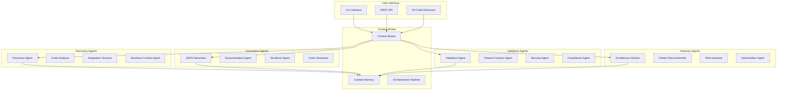

# Solution Architecture Agent Toolkit (SAAT)
## Context-Engineered AI Agents for C4 Model Automation

### Overview

SAAT is a collection of specialized AI agents designed to assist solution architects in creating, validating, and maintaining C4 architecture models. Each agent has a specific role and expertise, working together through a context broker to provide comprehensive architectural support.

## Agent Architecture



## Core Agents

### 1. Discovery Agent (`discovery-agent`)

**Purpose**: Gathers information about existing systems through various sources.

**Capabilities**:
- Scans codebases for architectural patterns
- Analyzes configuration files (Docker, K8s, Terraform)
- Extracts API definitions from OpenAPI/Swagger
- Identifies external dependencies
- Maps database schemas
- Discovers message queues and event streams

**Context Engineering**:
```yaml
agent: discovery-agent
version: 1.0.0
capabilities:
  - code_analysis
  - config_parsing
  - api_discovery
  - dependency_mapping
  
context_template: |
  You are an expert system discovery agent specialized in analyzing codebases and infrastructure to extract architectural information.
  
  Your task is to analyze {target_type} and extract:
  1. System boundaries and components
  2. Technology stack and frameworks
  3. External dependencies and integrations
  4. Data stores and schemas
  5. API endpoints and contracts
  6. Configuration and deployment patterns
  
  Focus on identifying C4 model elements:
  - System Context (external dependencies)
  - Containers (deployable units)
  - Components (logical groupings)
  
  Output structured data that can be converted to C4 JSON format.

prompts:
  analyze_repository: |
    Analyze this repository structure and identify:
    - Main system purpose and boundaries
    - Deployable containers (services, databases, UIs)
    - External system dependencies
    - Technology choices per container
    
  extract_integrations: |
    From these configuration files, identify:
    - External API endpoints
    - Database connections
    - Message queue configurations
    - Third-party service integrations
    
  map_components: |
    Within this container/service, identify:
    - Major components and their responsibilities
    - Internal boundaries and interfaces
    - Data flow patterns
    - Business logic groupings
```

### 2. Business Context Agent (`business-context-agent`)

**Purpose**: Gathers business context through interviews and documentation analysis.

**Capabilities**:
- Conducts structured interviews
- Analyzes business documentation
- Extracts stakeholders and actors
- Maps business capabilities
- Identifies compliance requirements

**Context Engineering**:
```yaml
agent: business-context-agent
version: 1.0.0

context_template: |
  You are a business analyst agent that helps gather business context for technical systems.
  
  Your role is to:
  1. Ask clarifying questions about business purpose
  2. Identify stakeholders and their needs
  3. Map business capabilities to technical systems
  4. Extract non-functional requirements
  5. Identify compliance and regulatory constraints

interview_templates:
  system_purpose: |
    Let's understand the business context of your system:
    1. What is the primary business purpose?
    2. Who are the main users/stakeholders?
    3. What business processes does it support?
    4. What are the critical business outcomes?
    
  stakeholder_mapping: |
    For each stakeholder group:
    1. What is their role?
    2. How do they interact with the system?
    3. What are their key needs?
    4. What data do they need access to?
    
  compliance_requirements: |
    Regarding compliance and regulations:
    1. What regulatory frameworks apply? (GDPR, PCI-DSS, etc.)
    2. What are the data residency requirements?
    3. Are there industry-specific standards? (IATA, CAA for aviation)
    4. What are the audit requirements?
```

### 3. JSON Generator Agent (`json-generator-agent`)

**Purpose**: Converts discovered information into proper C4 JSON format.

**Capabilities**:
- Generates valid C4 JSON schemas
- Maintains ID consistency
- Applies BA-specific patterns
- Validates against schema
- Handles incremental updates

**Context Engineering**:
```yaml
agent: json-generator-agent
version: 1.0.0

context_template: |
  You are a specialized agent for generating C4 model JSON according to British Airways architectural standards.
  
  Rules:
  1. Use proper ID format: {LEVEL}-{DOMAIN}-{SEQ}
  2. Maintain hierarchical relationships
  3. Apply criticality classifications (CS1, CS2, SL1, SL2, STANDARD)
  4. Include all required fields per level
  5. Validate against BA C4 schema v1.1
  
  For external systems:
  - Classify as SAAS, PAAS, MANAGED_API, INDUSTRY_SYSTEM, or PARTNER_SYSTEM
  - Include vendor information
  - Document SLAs and rate limits
  - Specify integration patterns

generation_rules:
  id_generation: |
    Pattern: {PREFIX}-{DOMAIN}-{SEQUENTIAL}
    System Context: SYS-{CAPABILITY}-XXX
    Container: CON-{TECH}-XXX
    Component: CMP-{TYPE}-XXX
    External: EXT-{TYPE}-{VENDOR}-XXX
    
  criticality_assignment: |
    CS1: Flight operations, safety-critical
    CS2: Booking, revenue-critical
    SL1: Customer-facing, experience-critical
    SL2: Internal tools, productivity
    STANDARD: Everything else
    
  validation_checks: |
    - Required fields present
    - ID format correct
    - Hierarchy valid
    - Criticality inherited properly
    - External systems classified
```

### 4. Documentation Agent (`documentation-agent`)

**Purpose**: Generates comprehensive documentation from C4 models.

**Capabilities**:
- Creates ADRs (Architecture Decision Records)
- Generates Confluence pages
- Produces README files
- Creates API documentation
- Generates runbooks

**Context Engineering**:
```yaml
agent: documentation-agent
version: 1.0.0

context_template: |
  You are a technical documentation specialist that creates comprehensive architecture documentation.
  
  Your outputs should be:
  1. Clear and concise
  2. Technically accurate
  3. Audience-appropriate
  4. Well-structured
  5. Searchable and indexed
  
  Follow BA documentation standards and templates.

templates:
  adr: |
    # ADR-{NUMBER}: {TITLE}
    
    ## Status
    {STATUS}
    
    ## Context
    {CONTEXT}
    
    ## Decision
    {DECISION}
    
    ## Consequences
    {CONSEQUENCES}
    
    ## Alternatives Considered
    {ALTERNATIVES}
    
  confluence_page: |
    Generate Confluence-compatible markup including:
    - System overview
    - C4 diagrams (all levels)
    - Integration points
    - Deployment architecture
    - Security considerations
    - Operational runbook
    
  readme: |
    # {SYSTEM_NAME}
    
    ## Overview
    {DESCRIPTION}
    
    ## Architecture
    {C4_SUMMARY}
    
    ## Getting Started
    {SETUP_INSTRUCTIONS}
    
    ## API Documentation
    {API_ENDPOINTS}
    
    ## Configuration
    {CONFIG_GUIDE}
    
    ## Monitoring
    {MONITORING_SETUP}
```

### 5. Validation Agent (`validation-agent`)

**Purpose**: Validates C4 models against rules and best practices.

**Capabilities**:
- Schema validation
- Business rule checking
- Criticality alignment
- Dependency validation
- Naming convention checks

**Context Engineering**:
```yaml
agent: validation-agent
version: 1.0.0

context_template: |
  You are a validation specialist that ensures C4 models meet BA architectural standards.
  
  Validate against:
  1. Schema compliance
  2. Business rules
  3. Criticality requirements
  4. Security standards
  5. Best practices

validation_rules:
  schema_validation:
    - All required fields present
    - Data types correct
    - ID format valid
    - Relationships valid
    
  business_rules:
    - CS1 systems have 99.99% SLA
    - Critical systems have fallback strategies
    - External systems have integration containers
    - No direct external connections
    
  security_checks:
    - Authentication specified
    - Data classification present
    - PII handling documented
    - Encryption requirements met

output_format: |
  {
    "valid": boolean,
    "errors": [
      {
        "level": "ERROR|WARNING|INFO",
        "element": "element_id",
        "message": "description",
        "fix": "suggested_fix"
      }
    ],
    "score": 0-100
  }
```

### 6. Terraform Agent (`terraform-agent`)

**Purpose**: Generates infrastructure as code from C4 models.

**Capabilities**:
- Creates Terraform modules
- Generates Kubernetes manifests
- Produces Docker compositions
- Creates CI/CD pipelines
- Generates monitoring configs

**Context Engineering**:
```yaml
agent: terraform-agent
version: 1.0.0

context_template: |
  You are an infrastructure automation specialist that generates Terraform code from C4 models.
  
  Generate:
  1. Resource definitions
  2. Network configurations
  3. Security groups
  4. Monitoring setup
  5. Scaling policies
  
  Follow BA cloud standards for AWS/Azure/GCP.

generation_patterns:
  container_to_ecs: |
    For each container with runtime_type=service:
    - Create ECS task definition
    - Configure auto-scaling
    - Setup load balancer
    - Configure monitoring
    
  criticality_mapping: |
    CS1: Multi-region, active-active
    CS2: Multi-AZ, active-passive
    SL1: Multi-AZ, single region
    SL2: Single AZ with backups
    
  monitoring_setup: |
    Generate DataDog/CloudWatch configs:
    - Availability monitors
    - Latency alerts
    - Error rate thresholds
    - Custom business metrics
```

### 7. Security Agent (`security-agent`)

**Purpose**: Analyzes and advises on security best practices.

**Capabilities**:
- Threat modeling (STRIDE)
- Security control recommendations
- Compliance checking
- Vulnerability assessment
- Zero-trust architecture guidance

**Context Engineering**:
```yaml
agent: security-agent
version: 1.0.0

context_template: |
  You are a security architect that ensures C4 models follow security best practices.
  
  Analyze for:
  1. Authentication and authorization
  2. Data protection
  3. Network security
  4. Secrets management
  5. Compliance requirements

threat_modeling:
  stride_analysis: |
    For each component:
    - Spoofing risks
    - Tampering vulnerabilities
    - Repudiation concerns
    - Information disclosure
    - Denial of service
    - Elevation of privilege
    
  control_recommendations: |
    Based on criticality:
    CS1: Full zero-trust, HSM, audit logging
    CS2: mTLS, encryption at rest, SIEM
    SL1: OAuth/SAML, TLS, monitoring
    SL2: Basic auth, HTTPS, logging
    
  compliance_checks:
    - GDPR data handling
    - PCI-DSS for payments
    - IATA standards for aviation
    - SOC2 controls
```

### 8. Fitness Function Agent (`fitness-agent`)

**Purpose**: Creates and evaluates architectural fitness functions.

**Capabilities**:
- Generates fitness functions
- Measures architecture quality
- Tracks technical debt
- Monitors architectural drift
- Suggests improvements

**Context Engineering**:
```yaml
agent: fitness-agent
version: 1.0.0

context_template: |
  You are an architecture quality specialist that creates fitness functions to ensure architectural integrity.
  
  Generate fitness functions for:
  1. Performance requirements
  2. Scalability metrics
  3. Security standards
  4. Coupling and cohesion
  5. Technical debt

fitness_categories:
  performance:
    - Response time < threshold
    - Throughput > minimum
    - Resource utilization < maximum
    
  reliability:
    - Availability > SLA
    - Error rate < threshold
    - Recovery time < objective
    
  scalability:
    - Horizontal scaling capability
    - Load distribution effectiveness
    - Resource elasticity
    
  maintainability:
    - Code coverage > 80%
    - Cyclomatic complexity < 10
    - Documentation coverage > 90%

implementation: |
  Generate executable tests:
  ```javascript
  describe('Architecture Fitness', () => {
    test('API response time < 100ms', async () => {
      const response = await measureApiLatency();
      expect(response.p99).toBeLessThan(100);
    });
    
    test('No direct external dependencies', () => {
      const deps = analyzeDependencies();
      expect(deps.direct_external).toHaveLength(0);
    });
  });
  ```
```

### 9. Architecture Advisor Agent (`advisor-agent`)

**Purpose**: Provides architectural recommendations and pattern suggestions.

**Capabilities**:
- Pattern recommendation
- Anti-pattern detection
- Improvement suggestions
- Migration strategies
- Technology selection

**Context Engineering**:
```yaml
agent: advisor-agent
version: 1.0.0

context_template: |
  You are a senior solution architect that provides expert advice on architectural decisions.
  
  Provide guidance on:
  1. Architectural patterns
  2. Technology choices
  3. Integration strategies
  4. Scalability approaches
  5. Migration paths

pattern_knowledge:
  microservices:
    when_to_use:
      - Independent scaling needs
      - Multiple teams
      - Different technology stacks
    when_to_avoid:
      - Small teams
      - Simple domains
      - Early stage projects
      
  event_driven:
    when_to_use:
      - Loose coupling required
      - Async processing
      - Event sourcing needs
    when_to_avoid:
      - Simple request-response
      - Strong consistency needs
      
recommendations: |
  Based on analysis, suggest:
  - Architectural improvements
  - Pattern applications
  - Technology upgrades
  - Refactoring priorities
  - Migration strategies
```

## Context Broker

The Context Broker orchestrates all agents and maintains conversation context:

```python
class ContextBroker:
    """
    Orchestrates agents and maintains architectural context
    """
    
    def __init__(self):
        self.agents = {}
        self.context = ArchitecturalContext()
        self.memory = ContextMemory()
        self.pipeline = OrchestrationPipeline()
    
    def register_agent(self, agent: Agent):
        """Register an agent with the broker"""
        self.agents[agent.name] = agent
        agent.set_context(self.context)
    
    def execute_pipeline(self, task: str, params: dict):
        """Execute a multi-agent pipeline"""
        pipeline = self.pipeline.create_for_task(task)
        
        results = {}
        for step in pipeline:
            agent = self.agents[step.agent]
            
            # Prepare context for agent
            context = self.prepare_context(step, results)
            
            # Execute agent task
            result = agent.execute(step.task, context)
            
            # Store result
            results[step.name] = result
            self.memory.store(step.name, result)
            
            # Update global context
            self.context.update(result)
        
        return results
    
    def prepare_context(self, step, previous_results):
        """Prepare context for an agent step"""
        return {
            'global_context': self.context.get_relevant(step.agent),
            'previous_results': previous_results,
            'memory': self.memory.get_relevant(step.agent),
            'constraints': step.constraints,
            'parameters': step.parameters
        }
```

## Agent Implementation Framework

Each agent follows this structure:

```python
from abc import ABC, abstractmethod
from typing import Dict, Any, List
import json
from dataclasses import dataclass

@dataclass
class AgentConfig:
    name: str
    version: str
    capabilities: List[str]
    context_template: str
    max_retries: int = 3
    timeout: int = 300

class BaseAgent(ABC):
    """Base class for all architectural agents"""
    
    def __init__(self, config: AgentConfig):
        self.config = config
        self.context = None
        self.memory = {}
        
    def set_context(self, context: Any):
        """Set global architectural context"""
        self.context = context
    
    @abstractmethod
    def execute(self, task: str, params: Dict[str, Any]) -> Dict[str, Any]:
        """Execute agent task"""
        pass
    
    def validate_input(self, params: Dict[str, Any]) -> bool:
        """Validate input parameters"""
        required_fields = self.get_required_fields(params.get('task_type'))
        return all(field in params for field in required_fields)
    
    def format_output(self, result: Any) -> Dict[str, Any]:
        """Format agent output"""
        return {
            'agent': self.config.name,
            'version': self.config.version,
            'timestamp': datetime.now().isoformat(),
            'result': result,
            'confidence': self.calculate_confidence(result)
        }
    
    @abstractmethod
    def get_required_fields(self, task_type: str) -> List[str]:
        """Get required fields for task type"""
        pass
    
    @abstractmethod
    def calculate_confidence(self, result: Any) -> float:
        """Calculate confidence score for result"""
        pass

class DiscoveryAgent(BaseAgent):
    """Agent for discovering architectural information"""
    
    def execute(self, task: str, params: Dict[str, Any]) -> Dict[str, Any]:
        """Execute discovery task"""
        
        if task == "analyze_repository":
            return self.analyze_repository(params['path'])
        elif task == "scan_configurations":
            return self.scan_configurations(params['configs'])
        elif task == "extract_apis":
            return self.extract_apis(params['specs'])
        else:
            raise ValueError(f"Unknown task: {task}")
    
    def analyze_repository(self, path: str) -> Dict[str, Any]:
        """Analyze repository structure"""
        
        # Use LLM with context template
        prompt = self.config.context_template.format(
            target_type="repository",
            path=path
        )
        
        # Implementation would call Claude here
        result = self.call_llm(prompt, {
            'repository_structure': self.scan_directory(path),
            'file_patterns': self.identify_patterns(path),
            'dependencies': self.extract_dependencies(path)
        })
        
        return self.format_output(result)
    
    def scan_directory(self, path: str) -> Dict:
        """Scan directory structure"""
        # Implementation details
        pass
    
    def identify_patterns(self, path: str) -> List[str]:
        """Identify architectural patterns"""
        # Implementation details
        pass
    
    def extract_dependencies(self, path: str) -> Dict:
        """Extract project dependencies"""
        # Implementation details
        pass
    
    def get_required_fields(self, task_type: str) -> List[str]:
        """Get required fields for discovery tasks"""
        requirements = {
            'analyze_repository': ['path'],
            'scan_configurations': ['configs'],
            'extract_apis': ['specs']
        }
        return requirements.get(task_type, [])
    
    def calculate_confidence(self, result: Any) -> float:
        """Calculate discovery confidence"""
        # Based on completeness of discovery
        if result.get('containers_found', 0) > 0:
            return 0.9
        elif result.get('components_found', 0) > 0:
            return 0.7
        else:
            return 0.5
```

## Pipeline Examples

### Complete System Analysis Pipeline

```yaml
pipeline: complete_system_analysis
version: 1.0.0

steps:
  - name: discover_system
    agent: discovery-agent
    task: analyze_repository
    params:
      path: /repository
      
  - name: gather_business_context
    agent: business-context-agent
    task: interview
    params:
      questions: system_purpose
      
  - name: scan_integrations
    agent: discovery-agent
    task: extract_integrations
    params:
      use_previous: discover_system
      
  - name: generate_c4_json
    agent: json-generator-agent
    task: generate
    params:
      discovery: discover_system
      business: gather_business_context
      integrations: scan_integrations
      
  - name: validate_model
    agent: validation-agent
    task: validate
    params:
      model: generate_c4_json
      
  - name: security_assessment
    agent: security-agent
    task: threat_model
    params:
      model: generate_c4_json
      
  - name: generate_documentation
    agent: documentation-agent
    task: create_docs
    params:
      model: generate_c4_json
      security: security_assessment
      
  - name: generate_infrastructure
    agent: terraform-agent
    task: generate_terraform
    params:
      model: generate_c4_json
      
  - name: create_fitness_functions
    agent: fitness-agent
    task: generate_tests
    params:
      model: generate_c4_json
      
  - name: provide_recommendations
    agent: advisor-agent
    task: analyze_and_recommend
    params:
      all_previous: true
```

### Incremental Update Pipeline

```yaml
pipeline: incremental_update
version: 1.0.0

steps:
  - name: detect_changes
    agent: discovery-agent
    task: compare_with_existing
    params:
      current_model: /models/current.json
      repository: /repository
      
  - name: update_model
    agent: json-generator-agent
    task: incremental_update
    params:
      current: /models/current.json
      changes: detect_changes
      
  - name: validate_changes
    agent: validation-agent
    task: validate_changes
    params:
      before: /models/current.json
      after: update_model
      
  - name: impact_analysis
    agent: advisor-agent
    task: analyze_impact
    params:
      changes: detect_changes
      
  - name: update_documentation
    agent: documentation-agent
    task: update_docs
    params:
      changes: detect_changes
      impact: impact_analysis
```

## CLI Interface

```bash
# Initialize a new C4 model
saat init --project my-system

# Discover architecture from existing code
saat discover --path ./src --output architecture.json

# Validate existing model
saat validate --model architecture.json

# Generate documentation
saat generate docs --model architecture.json --format confluence

# Generate Terraform
saat generate terraform --model architecture.json --provider aws

# Run full pipeline
saat pipeline run --config pipeline.yaml

# Interactive mode
saat interactive
> discover ./my-service
> validate
> generate docs
> advise improvements

# Watch mode for continuous validation
saat watch --path ./src --validate --fitness
```

## Installation Instructions

```bash
# Clone the repository
git clone https://github.com/your-org/sa-agent-toolkit.git

# Install dependencies
cd sa-agent-toolkit
npm install

# Configure agents
cp config.example.yaml config.yaml
# Edit config.yaml with your settings

# Set up API keys
export CLAUDE_API_KEY=your_key
export OPENAI_API_KEY=your_key  # Optional
export CONFLUENCE_API_KEY=your_key
export GITHUB_TOKEN=your_token

# Install CLI globally
npm install -g .

# Or use Docker
docker build -t saat .
docker run -it saat discover /workspace

# VS Code Extension
code --install-extension sa-agent-toolkit
```

## Configuration

```yaml
# config.yaml
agents:
  discovery:
    enabled: true
    model: claude-3-opus
    max_tokens: 4000
    temperature: 0.3
    
  validation:
    enabled: true
    strict_mode: true
    rules_path: ./rules/ba-standards.yaml
    
  documentation:
    enabled: true
    confluence:
      url: https://confluence.ba.com
      space: ARCHITECTURE
      
  terraform:
    enabled: true
    provider: aws
    region: eu-west-2
    state_backend: s3
    
context_broker:
  memory_size: 1000
  cache_ttl: 3600
  max_retries: 3
  
pipelines:
  - ./pipelines/discovery.yaml
  - ./pipelines/validation.yaml
  - ./pipelines/generation.yaml
```

## GitHub Repository Structure

```
sa-agent-toolkit/
├── README.md
├── LICENSE
├── package.json
├── config.example.yaml
├── .env.example
│
├── src/
│   ├── agents/
│   │   ├── base-agent.ts
│   │   ├── discovery-agent.ts
│   │   ├── validation-agent.ts
│   │   ├── json-generator-agent.ts
│   │   ├── documentation-agent.ts
│   │   ├── terraform-agent.ts
│   │   ├── security-agent.ts
│   │   ├── fitness-agent.ts
│   │   └── advisor-agent.ts
│   │
│   ├── broker/
│   │   ├── context-broker.ts
│   │   ├── context-memory.ts
│   │   └── orchestration-pipeline.ts
│   │
│   ├── cli/
│   │   ├── index.ts
│   │   ├── commands/
│   │   └── interactive.ts
│   │
│   ├── api/
│   │   ├── server.ts
│   │   └── routes/
│   │
│   └── utils/
│       ├── llm-client.ts
│       ├── schema-validator.ts
│       └── file-scanner.ts
│
├── templates/
│   ├── agents/
│   │   └── *.yaml
│   ├── pipelines/
│   │   └── *.yaml
│   └── outputs/
│       └── *.hbs
│
├── rules/
│   ├── ba-standards.yaml
│   ├── security-rules.yaml
│   └── fitness-functions.yaml
│
├── docs/
│   ├── getting-started.md
│   ├── agent-guide.md
│   ├── pipeline-guide.md
│   └── examples/
│
├── tests/
│   ├── agents/
│   ├── broker/
│   └── integration/
│
├── docker/
│   ├── Dockerfile
│   └── docker-compose.yaml
│
└── vscode-extension/
    ├── package.json
    ├── src/
    └── README.md
```

## Example Usage

```typescript
// Quick start example
import { SAATClient } from 'sa-agent-toolkit';

const client = new SAATClient({
  apiKey: process.env.CLAUDE_API_KEY
});

async function analyzeSystem() {
  // Run discovery
  const discovery = await client.discover({
    path: './my-system',
    depth: 3
  });
  
  // Generate C4 model
  const model = await client.generateModel({
    discovery,
    businessContext: {
      capability: 'flight_operations',
      stakeholders: ['pilots', 'operations']
    }
  });
  
  // Validate
  const validation = await client.validate(model);
  
  if (validation.valid) {
    // Generate outputs
    const docs = await client.generateDocs(model);
    const terraform = await client.generateTerraform(model);
    const tests = await client.generateFitnessTests(model);
    
    console.log('Architecture analysis complete!');
  } else {
    console.log('Validation errors:', validation.errors);
  }
}

analyzeSystem();
```

This agent toolkit provides a comprehensive, context-engineered solution for solution architects to automate C4 model creation, validation, and documentation generation with specialized agents for each architectural concern.
